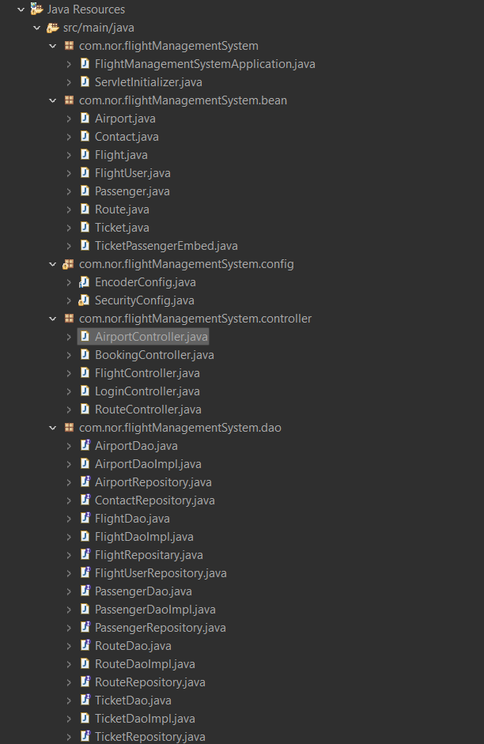
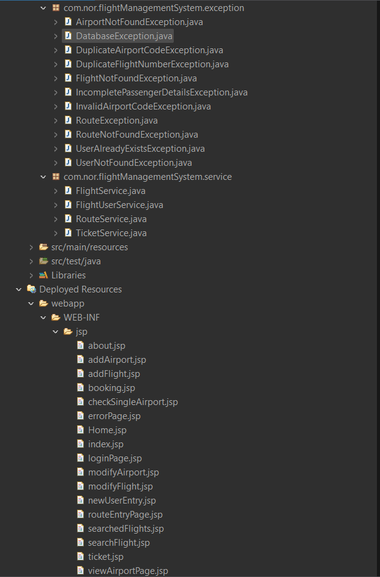
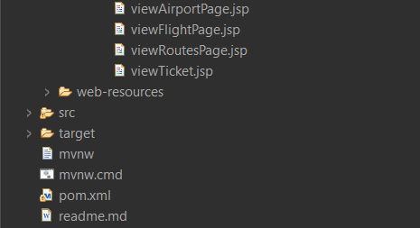

# Flight Management System

## Table of Contents

- [Introduction](#introduction)
- [Features](#features)
- [Technologies Used](#technologies-used)
- [Installation](#installation)
- [Usage](#usage)
- [Project Structure](#project-structure)
- [Contributing](#contributing)

## Introduction

The **Flight Management System** is a comprehensive application developed as part of an internship project at Infosys. It leverages Java Spring Boot to manage flight reservations, user registrations, and administrative functionalities. The system is designed to facilitate smooth and efficient handling of flight-related operations for both customers and administrators.

## Features

- User registration and authentication
- Flight booking and cancellation
- Admin dashboard for managing flights
- Dynamic web pages using JSP and JSTL
- Integration with MySQL for data persistence

## Technologies Used

- **Java Spring Boot**: Framework for building the application.
- **Spring Data JPA**: For database operations.
- **Spring Security**: For securing the application.
- **JSP and JSTL**: For building the front-end.
- **MySQL**: Database for storing flight and user data.
- **Maven**: Build automation tool.

## Installation

Follow these steps to set up the project locally:

1. **Clone the repository:**
    ```bash
    git clone https://github.com/ojasvatstyagi/flight-management-system.git
    cd flight-management-system
    ```

2. **Update database configurations:**
    - Open `src/main/resources/application.properties`
    - Update the following properties with your MySQL credentials:
    ```properties
    spring.datasource.url=jdbc:mysql://localhost:3306/airlinedb
    spring.datasource.username=root
    spring.datasource.password=yourpassword
    ```

3. **Build the project:**
    ```bash
    mvn clean install
    ```

4. **Run the application:**
    ```bash
    mvn spring-boot:run
    ```

## Usage

- **Access the application:** Open a web browser and navigate to `http://localhost:9092`.
- **Registration:** Navigate to `/register` to create a new user.
- **Login:** Use `/loginpage` to log in to the application.
- **Admin Access:** Admin-specific functionalities can be accessed after logging in as an admin.

## Project Structure




